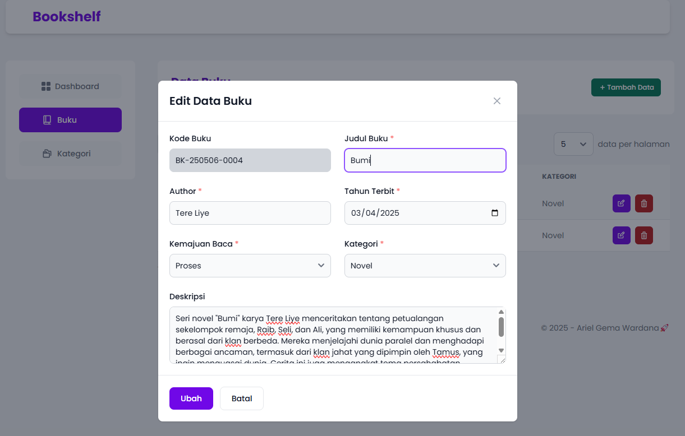

# Bookshelf - App Mini CRUD (PHP)
Bookshelf adalah sebuah aplikasi mini crud tentang catatan buku yang dibaca oleh pengguna.   

Pada aplikasi ini style mysqli yang digunakan ialah object-oriented. Pada [config/Database.php](https://github.com/ArielGwd/tugas1-pemrograman-web2/blob/main/config/Database.php) di baris [13](https://github.com/ArielGwd/tugas1-pemrograman-web2/blob/72b1c8c8d7a404a47a7374d0dcbf182c6ecbb305/config/Database.php#L13) terdapat `new mysqli()` yang dimana digunakan untuk koneksi ke database mysql. 

## Struktur Database
```sql
Database: tugas_web2_arielgema 
table: 
  - books : {kd_buku, title, author, year_published, progress, category_id, description}
  - categories: {id, name}
``` 

## App Workflow 
### Persiapan 
1. Node.js v20.18.2 ([ Node.js](https://nodejs.org/en/download)) 
2. PHP 8.0+ atau 8.3.8 (([xampp](https://www.apachefriends.org/download.html) atau [laragon](https://laragon.org/download/)))
3. MySQL atau MariaDB 
4. GIT (Opsional) 

### Clone Repository   
1. Buka file manager / Finder / file explorer
2. Navigasi ke folder tempat Anda ingin menyimpan project, misalnya `xampp\htdocs` (XAMPP) atau `laragon\www` (Laragon)
3. Lalu klik kanan pada area kosong lalu pilih `Open in Terminal` atau pilih git bash
4. Kemudian, jalankan code dibawah ini :
```bash
git clone https://github.com/ArielGwd/tugas1-pemrograman-web2.git
cd tugas1-pemrograman-web2 
```  

kemudian ke browser buka `http://localhost/tugas1-pemrograman-web2/`

### Install Dependency
jika node_modules tidak ada atau beberapa fungsi tidak bisa digunakan, jalankan code dibawah ini :
```bash
npm install
npm run build
``` 

kemudian buka browser kembali `http://localhost/tugas1-pemrograman-web2/`. Setelah itu, cek kembali apakah bisa digunakan tombol-tombol atau beberapa fungsi lainnya


## Fitur
- Create
- Read
- Update
- Delete
- Search ([datatables library](https://datatables.net/))
- Pagination ([datatables library](https://datatables.net/))

## Tech stack
[](https://skillicons.dev)
  
## Preview  
1. Dashboard

 
2. Book Page


3. Add Book Modal


4. Edit Book Modal

