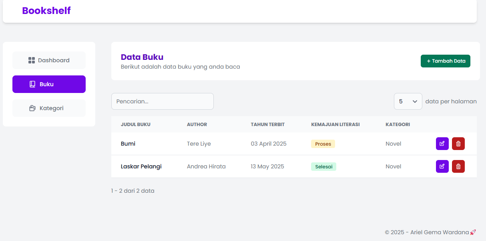

# Bookshelf - App Mini CRUD (PHP)
Bookshelf adalah sebuah aplikasi mini crud tentang catatan buku yang dibaca oleh pengguna.   

Pada aplikasi ini style mysqli yang digunakan ialah object-oriented. Pada [config/Database.php](https://github.com/ArielGwd/tugas1-pemrograman-web2/blob/main/config/Database.php) di baris [13](https://github.com/ArielGwd/tugas1-pemrograman-web2/blob/72b1c8c8d7a404a47a7374d0dcbf182c6ecbb305/config/Database.php#L13) terdapat `new mysqli()` yang dimana digunakan untuk koneksi ke database mysql. 

## Daftar isi
- [Daftar isi](https://github.com/ArielGwd/Tugas1_PemrogramanWeb2_ArielGemaWardana_230401010057/edit/main/README.md#daftar-isi)
- [Persiapan](https://github.com/ArielGwd/Tugas1_PemrogramanWeb2_ArielGemaWardana_230401010057/edit/main/README.md#persiapan)
  - [Clone Repository](https://github.com/ArielGwd/Tugas1_PemrogramanWeb2_ArielGemaWardana_230401010057/edit/main/README.md#--clone-repository)
  - [Install Dependency](https://github.com/ArielGwd/Tugas1_PemrogramanWeb2_ArielGemaWardana_230401010057/edit/main/README.md#--install-dependency)
- [Alur Kerja Aplikasi](https://github.com/ArielGwd/Tugas1_PemrogramanWeb2_ArielGemaWardana_230401010057/edit/main/README.md#alur-kerja-aplikasi)
- [Fitur](https://github.com/ArielGwd/Tugas1_PemrogramanWeb2_ArielGemaWardana_230401010057/edit/main/README.md#fitur)
- [Tech stack](https://github.com/ArielGwd/Tugas1_PemrogramanWeb2_ArielGemaWardana_230401010057/edit/main/README.md#tech-stack)
- [Struktur Database](https://github.com/ArielGwd/Tugas1_PemrogramanWeb2_ArielGemaWardana_230401010057/edit/main/README.md#struktur-database)
- [Preview](https://github.com/ArielGwd/Tugas1_PemrogramanWeb2_ArielGemaWardana_230401010057/edit/main/README.md#preview)

## Persiapan 
1. Node.js v20.18.2 ([ Node.js](https://nodejs.org/en/download)) 
2. PHP 8.0+ atau 8.3.8 (([xampp](https://www.apachefriends.org/download.html) atau [laragon](https://laragon.org/download/)))
3. MySQL atau MariaDB 
4. GIT (Opsional)

### - Clone Repository   
1. Buka file manager / Finder / file explorer
2. Kemudian masuk ke folder tempat `xampp\htdocs` (XAMPP) atau `laragon\www` (Laragon)
3. Lalu klik kanan pada area kosong lalu pilih `Open in Terminal` atau pilih `git bash`
4. Kemudian, jalankan perintah dibawah ini :
```bash
git clone https://github.com/ArielGwd/Tugas1_PemrogramanWeb2_ArielGemaWardana_230401010057.git
cd Tugas1_PemrogramanWeb2_ArielGemaWardana_230401010057 
```  

kemudian ke browser buka `http://localhost/tugas1-pemrograman-web2/`

### - Install Dependency
jika node_modules dan css tidak ada atau beberapa fungsi tidak bisa digunakan, jalankan perintah dibawah ini :
```bash
npm install
npm run build
``` 

kemudian buka browser kembali `http://localhost/tugas1-pemrograman-web2/`. Setelah itu, cek kembali apakah bisa digunakan tombol-tombol dan beberapa fungsi lainnya

## Alur Kerja Aplikasi
aplikasi memiliki menu yaitu dashboard, buku, dan kategori. masing-masing memiliki alurnya sendiri yaitu :
- Halaman `Dashboard` : Menampilkan halaman awal.
- Halaman `Buku` : Menampilkan data `books` dari database. kemudian terdapat sebuah button atau tombol yaitu `tambah`, dimana button tersebut ketika diklik akan menampilkan modal atau pop up untuk menginput data. begitupun untuk button `edit` dan `hapus` akan menampilkan popup, pop up `edit` akan menampilkan inputan edit dan pop up `hapus` akan menampilkan pop konfirmasi untuk menghapus data.
- Halaman `Kategori` : Menampilkan data `categories` dari database. kemudian terdapat sebuah button atau tombol yaitu `tambah`, dimana button tersebut ketika diklik akan menampilkan modal atau pop up untuk menginput data. begitupun untuk button `edit` dan `hapus` akan menampilkan popup, pop up `edit` akan menampilkan inputan edit dan pop up `hapus` akan menampilkan pop konfirmasi untuk menghapus data.

## Fitur
- Create
- Read
- Update
- Delete
- Search ([datatables library](https://datatables.net/))
- Pagination ([datatables library](https://datatables.net/))

## Tech stack
[](https://skillicons.dev)
  
## Struktur Database
struktur database [SQL](tugas_web2_arielgema.sql) atau bisa dilihat dibawah ini
```bash
Database: tugas_web2_arielgema 

-- table: 
books : {
    kd_buku varchar(225) NOT NULL PRIMARY KEY,
    title varchar(225) NOT NULL, 
    author varchar(225) NOT NULL, 
    year_published date NOT NULL,
    progress enum('selesai','proses','belum') NOT NULL,
    category_id int NOT NULL INDEX,
    description text
}

categories: {
    id int NOT NULL PRIMARY KEY,
    name varchar(225) NOT NULL
} 
``` 

## Preview  
1. Dashboard

 
2. Book Page


3. Add Book Modal


4. Edit Book Modal


5. Category Page


6. Add Category Modal


7. Edit Category Modal


