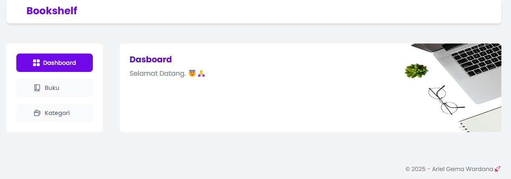
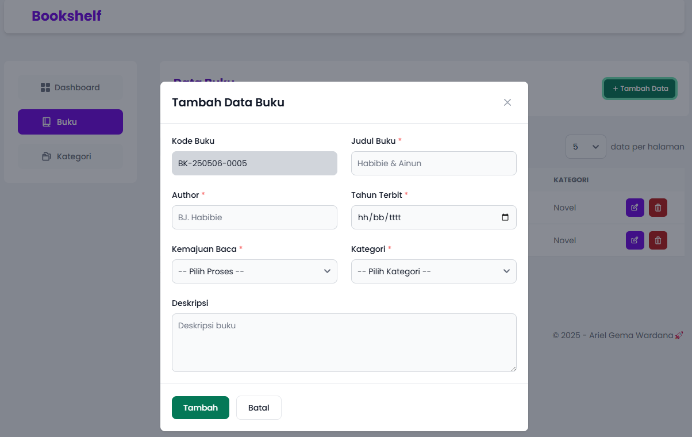

# Bookshelf - App Mini CRUD (PHP)
adalah sebuah aplikasi mini crud tentang catatan buku yang dibaca oleh pengguna.  

## Feature
- Create
- Read
- Update
- Delete
- Search
- Pagination 

## Database Structure
```sql
Database: tugas_web2_arielgema 
table: books 
```
## Tech
[](https://skillicons.dev)
  
## Preview  
1. Dashboard

 
2. Book Page


3. Add Book Modal


4. Edit Book Modal

